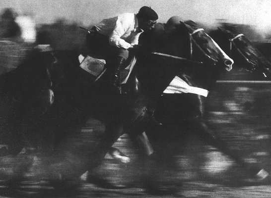

# Not a bean, just a nice spritz with Legui liqueur

A simple concoction  of:

  - 3 cl Legui liqueur
  - 3 cl Mezcal
  - 3 cl of a dry white and strong vermouth
  - Half a lemon, squeezed and dropped into your glass
  - 1 pinch of salt
  - Filled up with soda water
