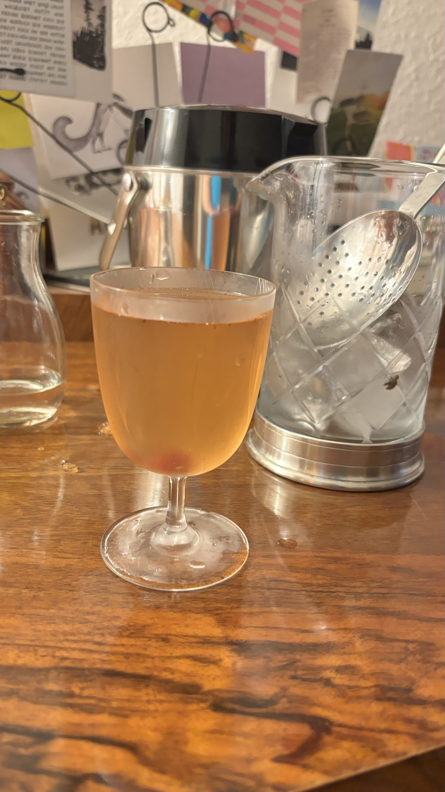

# Sake-Beere

So first find some wild strawberries, approx 50g (which is a lot of work).
Add the fruits of your hard labour to a jar, cover them with 50g of sugar and let it sit over night.
Then add together:

  - 3 cl Sake
  - 4 cl Havana Club 3 Años
  - 1 Barspoon of the strawberry syrup you made the day before
  - 3 Dashes of orange bitters
  - 1 Barspoon of vanilla-grappa

  And stir it all together with some ice, strain into a cocktail glass and garnish with a wild sugared strawberry :-)

